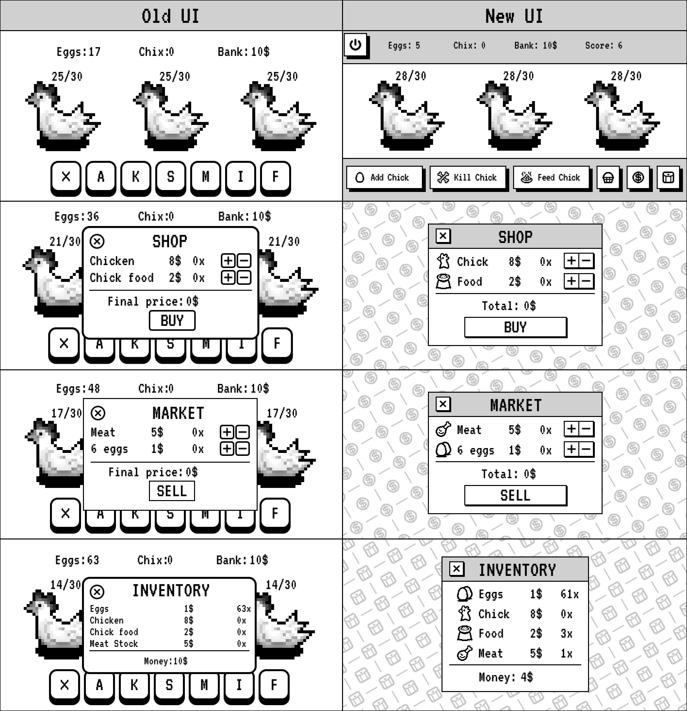

# Chicken-Farm-Pygame (WIP!)

/+\\/+\\/+\\/+\\/+\\/+\\/+\\/+\\/+\\/+\\!ACHTUNG!/+\\/+\\/+\\/+\\/+\\/+\\/+\\/+\\/+\\/+\\
# Game is still work in progress!
/+\\/+\\/+\\/+\\/+\\/+\\/+\\/+\\/+\\/+\\!ACHTUNG!/+\\/+\\/+\\/+\\/+\\/+\\/+\\/+\\/+\\/+\\

## About
This repo is for my finall assignment for my python cource in university. This is a chicken farm game, fairly simple concept, pixel graphics. Game written in python using pygame.

## Preparation 
- Python 3.12.6
- Pygame-ce 2.5.5
  `pip install pygame-ce`
- Download the "Assets" folder

# Devlog
## [Public Kanban board](https://planet-nose-f59.notion.site/TB1-FA-Chick-Farm-22c380ac3809803ebdbbcf0d9b368ae9?source=copy_link)
## Sep 11th 2025
- Rolling out pre-release version, likely it's THE release version, since I won't have much time to work on this game, reasons being other uni assignments.
- Introducing save/load feature (though incomplete, it does the job mostly)
- New window: Menu, in which player can save game, load previous save and exit the game
- Inventories and other containers moved back in main file
- Some Chicken class functions were brought to main file 
## Sep 06th 2025
- Overhaul of UI
- Change in item names
- Introducing Score feature 
## Sep 03th 2025
- Small patch, reworked the add to shop cart feature, now it won't let player add more than they can afford.
- Next update is planned to introduce long awaited (by me at least), visual overhaul of this project.
## Sep 02th 2025
- Chicken Class was separated from main game file.
- Containers (i.e. Catalogue, Shop Cart, Sell Cart and Inventory) were separated into a different file called Inventory.py
- Added hunger and feed functions. Gone the days of prosperity and abundance of food, your chicks now get hungry overtime and will stop hatching eggs once their HP (hunger points) reach 1!
- Updated Nests dict, the spawn function and health display function (this almost killed me mentally)
Known bugs:
- Sometimes chicken spawns with 1 hp instead of 50
## Aug 29th 2025
- Added proper window button manager. Before player was able to click buttons that were invisible, but still clickable. For example: Market and Shop windows exit button have the same position, when you tried to leave either of these two windows, you would actually click both buttons at the same time. Now it's fixed!
- Changed Button class, added a parameter which tracks if button can be clicked, accompanied by a function and a variable that both track current window.
- Market is now open! ~~although, player still can't sell anything, since when I started implementing the market feature I jumped halfway to fix the button issue.~~ Sell all your hard hatched eggs and meat on a market, receiving in return the money!
- The font was changed to VT323, from Google Fonts, previous font I used was only for personal use, so to not accidentally violate the font's license, I changed the font. Some graphic elements though might still contain the old font.
## Aug 26th 2025
- The Shop now accepts your hard-earned money! Although, you only have 10 bucks for now, and can't get more since the feature to sell eggs and meat is not here yet, but it's coming soon!
- Inventory is a thing now, you can appreciate the magnificently low amount of things you have there!
- Changed a structure of counters, now the numbers come directly from Inventory list.
- A lot of little things being changed and moved here and there.
## Aug 19th 2025
Fixed the bug with Add_Chick_Btn and Kill_Chick_Btn

Shop opened its doors! New shop button has been added, now new window appears in which player can add items to cart (or remove them if they changed their mind). Although, buying feature is still in works, since it requires to make inventory, wallet and sell features.
## Aug 18th 2025
Add and Kill chicken buttons are now working
Known bugs:
Sometimes chicken does not appear or disappear after first click, requiring to click the buttons twice
## Aug 9th 2025
Implemented pygame sprites, which will drastically ease the work. The implementation still not fully done though. Regardless it will speed things up a lot and I can actually see how to move forward with the project!
## Jul 20th 2025
Finally managed to make eggs to passively spawn each 5 seconds, without stopping the whole program. Now it just needs some polishing.